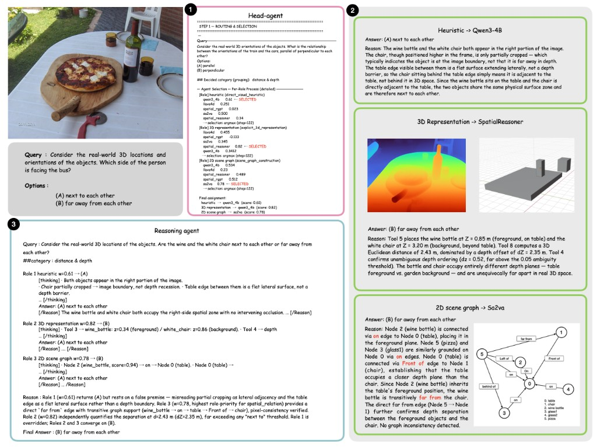
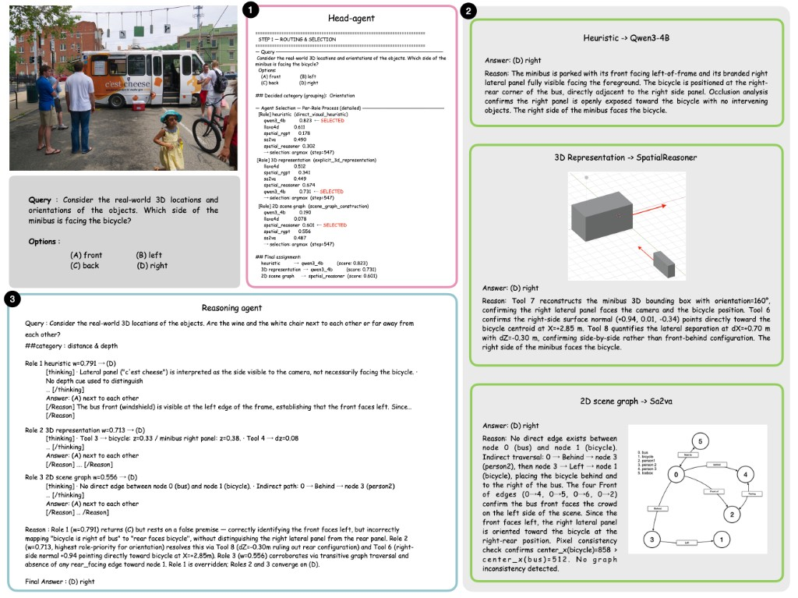

# SpatiO

**Adaptive Test-Time Orchestration of Vision-Language Agents for Spatial Reasoning**

> **ECCV 2026 — Accepted**

Basic code: **Head + 5 specialists + TTO**.  
Official **Reasoning Agent** comes later (interim Qwen3-VL / `--final_aggregator majority`).

```
Image + Query → Head → 5 Specialists → Reasoning (TTO) → Answer
```

## Figures

| Observation | Pipeline |
|:-----------:|:--------:|
|  |  |

## Models

| Role | Id | Checkpoint |
|------|-----|------------|
| Head | `qwen3_4b` | `Qwen/Qwen3-VL-4B-Instruct` |
| Specialist | `llava4d` | `llava-hf/llava-1.5-7b-hf` |
| Specialist | `sa2va` | `ByteDance/Sa2VA-4B` |
| Specialist | `qwen3_4b` | `Qwen/Qwen3-VL-4B-Instruct` |
| Specialist | `spatial_rgpt` | `a8cheng/SpatialRGPT-VILA1.5-8B` |
| Specialist | `spatial_reasoner` | `ccvl/SpatialReasoner` |
| Reasoning | `deepseek_r1` | *later* (interim: Qwen3-VL-8B) |

## Setup

Requires **Python ≥ 3.10**, conda, and CUDA GPUs.

### 1. Clone this repository

```bash
git clone https://github.com/CY-H1329/SpatiO.git
cd SpatiO
```

### 2. Create the environment

```bash
bash scripts/setup_env.sh
conda activate spatial_reasoning
```

This installs PyTorch (CUDA wheels by default) and the packages in `requirements-no-torch.txt`.  
Optional: `export TORCH_INDEX_URL=https://download.pytorch.org/whl/cu124` (or `.../cpu`) before running the script.

### 3. Clone SpatialRGPT (needed for the `spatial_rgpt` specialist)

```bash
git clone https://github.com/AnjieCheng/SpatialRGPT.git ../SpatialRGPT
export SPATIALRGPT_PATH="$(cd ../SpatialRGPT && pwd)"
```

Add the `export` line to your shell profile if you want it permanent.

### 4. Sanity checks

```bash
python scripts/smoke_test.py      # pipeline + TTO with mock VLMs (CPU)
python scripts/verify_env.py      # torch / transformers / backends
python -m spatio.skeleton         # print Head + 5 specialists layout
```

More detail: [docs/REPRODUCTION.md](docs/REPRODUCTION.md).

## Run

`device_map` order is:

`head, reasoner, llava4d, sa2va, qwen3_4b, spatial_rgpt, spatial_reasoner`

Multi-GPU is recommended for the full 5-specialist stack.

### CV-Bench

```bash
export SPATIALRGPT_PATH="$(cd ../SpatialRGPT && pwd)"

python evals/run_cvbench.py \
  --max_samples 50 \
  --test_only \
  --top_k 5 \
  --device_map 0,1,2,3,4,5,6 \
  --output_dir results/cvbench
```

### 3DSRBench

```bash
python evals/run_3dsrbench.py \
  --max_samples 50 \
  --test_only \
  --top_k 5 \
  --device_map 0,1,2,3,4,5,6 \
  --output_dir results/3dsr
```

### Other benchmarks

```bash
python evals/run_stvqa.py  --max_samples 50 --test_only --top_k 5 \
  --device_map 0,1,2,3,4,5,6 --output_dir results/stvqa

python evals/run_mmsi.py   --max_samples 50 --test_only --top_k 5 \
  --device_map 0,1,2,3,4,5,6 --output_dir results/mmsi
```

### Without the interim reasoner VLM

Until the official Reasoning Agent is released, you can aggregate specialists only:

```bash
python evals/run_cvbench.py \
  --max_samples 50 --test_only --top_k 5 \
  --final_aggregator majority \
  --device_map 0,0,1,2,3,4,5 \
  --output_dir results/cvbench_majority
```

## Repository layout

```
SpatiO/
├── README.md
├── LICENSE
├── requirements.txt
├── assets/figures/     # paper figures
├── docs/               # reproduction notes
├── scripts/            # setup, smoke, verify
├── evals/              # benchmark entry points
└── spatio/             # core library (pipeline, models, roles, …)
```

## Hyperparameters

κ=0.5 · μ=0.3 · γ=0.3 · λf=0.3 · λg=0.1 · T=5 · β=5 — see `spatio/config.py`.

## Citation

```bibtex
@inproceedings{spatio2026,
  title     = {SpatiO: Adaptive Test-Time Orchestration of Vision-Language Agents for Spatial Reasoning},
  booktitle = {European Conference on Computer Vision (ECCV)},
  year      = {2026}
}
```

## License

MIT — [LICENSE](LICENSE).
